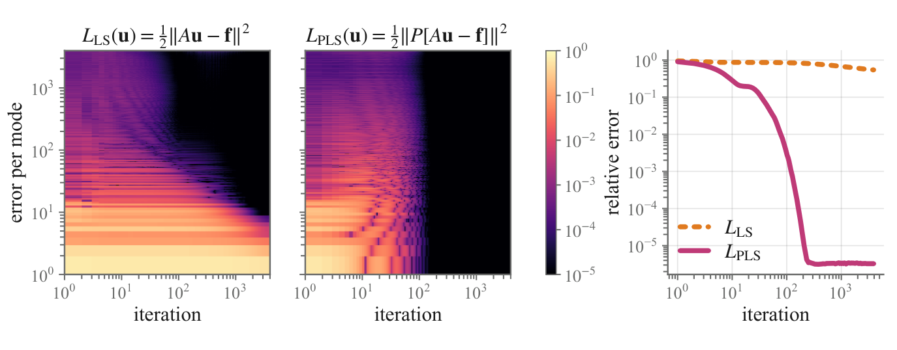
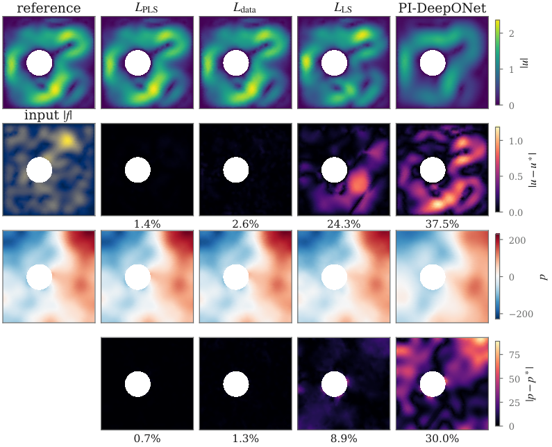
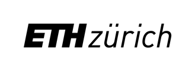

<h1 align="center">TensorPILS</h1>

<p align="center">
  <strong>Preconditioned physics-informed training of neural operators.</strong><br/>
  Official implementation of <em>Preconditioned Physics-Informed Neural Operator Training</em>
</p>

<p align="center">
  Shizheng Wen, Siddhartha Mishra, Marius Zeinhofer<br/>
  ETH Zürich
</p>

<p align="center">
  <a href="#installation">Installation</a> &nbsp;|&nbsp;
  <a href="#quickstart">Quickstart</a> &nbsp;|&nbsp;
  <a href="#results">Results</a> &nbsp;|&nbsp;
  <a href="#experiments">Experiments</a> &nbsp;|&nbsp;
  <a href="#citation">Citation</a>
</p>

<p align="center">
  <!-- arXiv: <a href="https://arxiv.org/abs/XXXX.XXXXX"></a> -->
  
  
  <a href="https://github.com/camlab-ethz/TensorMesh"></a>
  <a href="LICENSE"></a>
</p>

<p align="center">
  
  <br/>
  <em>Adam on the physics-informed least-squares loss of a linear model (Poisson, 65 × 65 grid).
  Left and centre: error in each eigenmode of the stiffness matrix, smoothest at the bottom, without
  and with a multigrid preconditioner. Right: relative L² error.</em>
</p>

---

Physics-informed losses let a neural operator learn from the governing equations alone, without a
dataset of solutions, but they are badly conditioned: the Hessian of the finite-element residual
loss `L_LS(u) = ½‖Au − f‖²` is `AᵀA`, whose condition number grows like `h⁻⁴` as the mesh is
refined. TensorPILS trains neural operators with the **preconditioned residual loss**

```math
L_\mathrm{PLS}(u) = \tfrac{1}{2}\,\bigl\|P\,(Au - f)\bigr\|^2, \qquad P \approx A^{-1},
```

where `P` is one multigrid V-cycle; for the Stokes saddle point a block preconditioner weights the
residual instead. The finite-element operators come from
[TensorMesh](https://github.com/camlab-ethz/TensorMesh).

## Highlights

- **Label-free.** Training needs only the PDE, so fresh samples can be drawn at every step.
- **Well-conditioned.** For elliptic problems the conditioning of the loss does not depend on the
  mesh, and physics-informed training reaches the accuracy of supervised training.
- **General.** Linear and nonlinear, steady and time-dependent problems (Poisson, Allen–Cahn,
  Stokes), on structured grids with geometric multigrid and on unstructured meshes with algebraic
  multigrid, including the Stokes saddle point through a block preconditioner.
- **Architecture-agnostic.** Works with FNO and GAOT. The preconditioner enters only the loss, so
  inference costs nothing extra.

## Installation

**Requirements:** Python ≥ 3.10, PyTorch ≥ 2.0, an NVIDIA GPU.

```bash
git clone https://github.com/camlab-ethz/TensorPILS.git
cd TensorPILS
pip install torch==2.11.0 --index-url https://download.pytorch.org/whl/cu128
pip install -e .
```

This also installs [TensorMesh](https://github.com/camlab-ethz/TensorMesh) (`tensormesh-fem`, the
finite elements) and [neuraloperator](https://github.com/neuraloperator/neuraloperator) (the FNO).

The Stokes preconditioner applies algebraic multigrid through
[torch-amgx](https://github.com/sparsexlab/torch-amgx), which is not on PyPI; its
[release wheels](https://github.com/sparsexlab/torch-amgx/releases) are built for particular
PyTorch and CUDA versions (PyTorch 2.11 with CUDA 12.6 or 12.8, or PyTorch 2.6 with CUDA 12.4),
hence the pinned PyTorch above. For Python 3.11:

```bash
pip install https://github.com/sparsexlab/torch-amgx/releases/download/v0.1.0a14/torch_amgx-0.1.0a14-0_cu128_torch211-cp311-cp311-manylinux_2_34_x86_64.manylinux_2_35_x86_64.whl
```

Everything else runs with any PyTorch ≥ 2.0 and without torch-amgx.

<details>
<summary>Notes</summary>

- Gmsh, which meshes the Stokes domain, needs the system library `libGLU.so.1`
  (e.g. `apt install libglu1-mesa`).
- `torch-scatter` and `torch-cluster` speed up the graph operations of GAOT; without them a
  pure-PyTorch fallback is used.
- The tests run with `pip install -e ".[test]"` and `pytest`; those that need torch-amgx are
  skipped without it. Tested with Python 3.11 on an NVIDIA RTX 4090.

</details>

## Quickstart

### Command line

Every run is one call of `tensorpils` (equivalently `python -m tensorpils.cli`). `--loss pls` is
the preconditioned loss; `galerkin` is the unpreconditioned residual, `data` supervised training,
and `pino` and `pideeponet` are the baselines.

```bash
# Poisson: FNO on a 65 x 65 grid, preconditioned by a geometric multigrid V-cycle
tensorpils --pde poisson --model fno --loss pls -k 10 --grid_resolution 65 --lr 3e-4 --lr_min 3e-5

# Allen-Cahn: one time step, residual preconditioned by a V-cycle for the frozen Jacobian
tensorpils --pde ac --model fno --loss galerkin --ac_precond multigrid --ac_eps 32 -k 4 \
    --grid_resolution 129 --dt 0.01 --n_steps 10 --rollout_steps 10 --batch_size 16 \
    --lr 3e-4 --lr_min 3e-5

# Stokes around an obstacle: GAOT on an unstructured P2/P1 mesh, block preconditioner
tensorpils --pde stokes --model gaot --loss pls --schur_omega 16 -k 10 --lr 1e-3 --lr_min 1e-6
```

Results go to `output/`: `results/<run>.json` with the configuration, the per-epoch statistics and
the test errors, the best checkpoint, and diagnostic plots. `tensorpils --help` lists all options.

### In your own code

The finite-element operators, preconditioners and losses are ordinary PyTorch modules:

```python
import torch
from tensorpils import (structured_quad_mesh, PoissonProblem, build_preconditioner,
                        build_loss, grid_to_node)
from tensorpils.models import FNOModel

n, device = 65, "cuda"
problem = PoissonProblem(structured_quad_mesh(n, n)).to(device)    # stiffness A, mass M
P = build_preconditioner("multigrid", problem, grid_size=(n, n), device=device)   # P ≈ A⁻¹
loss_fn = build_loss("pls", problem, precond=P)                    # ½‖P(Au − Mf)‖²

model = FNOModel(n_modes=(16, 16), hidden_channels=64).to(device)
f = torch.randn(8, 1, n, n, device=device)                         # a batch of sources
u = model(f)                                                       # [8, 1, n, n]
loss = loss_fn(grid_to_node(u[:, 0], n, n), grid_to_node(f[:, 0], n, n))   # no labels
loss.backward()
```

## Results

Test relative L² error in %, mean ± half-range over three seeds. `L_data` is trained on labelled
solutions, the other methods only on the PDE; bold marks the best of those.

| | `L_PLS` (ours) | `L_data` (supervised) | PINO | PI-DeepONet |
|---|:-:|:-:|:-:|:-:|
| Poisson | **5.1 ± 0.8** | 4.7 ± 0.8 | 33.1 ± 1.1 | 21.4 ± 4.7 |
| Allen–Cahn | **3.2 ± 0.3** | 2.0 ± 0.2 | 5.3 ± 1.6 | 90.0 ± 1.7 |
| Stokes, velocity | **1.6 ± 0.2** | 3.3 ± 0.2 | — | 39.7 ± 2.1 |
| Stokes, pressure | **0.85 ± 0.04** | 1.79 ± 0.16 | — | 36.7 ± 0.6 |

PINO's finite-difference residual needs a grid and has no counterpart on the unstructured Stokes
mesh.

<p align="center">
  
  <br/>
  <em>Stokes flow around an obstacle, one test sample: velocity magnitude and pressure with their
  errors for the preconditioned loss, supervised training, the unpreconditioned residual and
  PI-DeepONet.</em>
</p>

## Experiments

Every table and figure of the paper has a directory under [`experiments/`](experiments/README.md)
with the launchers, the analysis scripts and the expected numbers.

## Repository structure

```
tensorpils/
├── meshing.py          structured grids, the obstacle mesh, grid <-> node ordering
├── physics.py          finite-element operators for Poisson, Allen-Cahn and Stokes
├── preconditioners/    geometric and algebraic multigrid, spectral blend, Stokes block
├── losses.py           L_data, L_LS and L_PLS for each problem
├── data.py             datasets and finite-element reference solutions
├── models.py           FNO (from neuraloperator)
├── gaot/               GAOT, the geometry-aware operator transformer
├── baselines/          PINO, DeepONet and physics-informed DeepONet
├── trainer.py          training loops for the static and the time-stepping problems
└── cli.py              command-line interface
experiments/            launchers and analysis scripts of the paper
tests/                  unit tests
```

## Citation

If you use this code, please cite:

```bibtex
@article{wen2026preconditioned,
  title   = {Preconditioned Physics-Informed Neural Operator Training},
  author  = {Wen, Shizheng and Mishra, Siddhartha and Zeinhofer, Marius},
  journal = {arXiv preprint},
  year    = {2026}
}
```

## License

TensorPILS is released under the [Apache License 2.0](LICENSE). `tensorpils/gaot/` is adapted from
[GAOT](https://github.com/camlab-ethz/GAOT).

## Acknowledgements

<p align="center">
  <a href="https://camlab.ethz.ch/"></a>
  &nbsp;&nbsp;&nbsp;&nbsp;&nbsp;&nbsp;&nbsp;
  <a href="https://ai.ethz.ch/"></a>
  &nbsp;&nbsp;&nbsp;
  <a href="https://ethz.ch/"></a>
</p>
